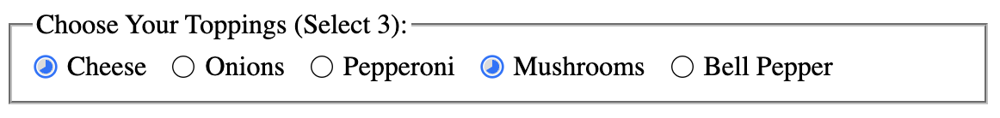

# Slice Selector Web Component Experiment

## Overview

The Slice Selector is an experimental web component that allows users to make selections in an engaging and visually intuitive way. Inspired by the concept of a pie chart, each `slice-selector` represents a clickable segment that toggles its selection state on click. This component is ideal for cases where a standard checkbox or radio button may not provide the desired user experience or visual appeal.



## Features

- **Interactive Pie Chart Slices**: Each selector acts as a pie chart segment, giving immediate visual feedback on selection.
- **Customizable**: Easily define the number of slices and customize the appearance via CSS.
- **Accessible**: Built with accessibility in mind, supporting keyboard navigation and ARIA attributes.

## How It Works

The `slice-selector` component can be used within a `slice-selector-group`, which manages the collective state of its child selectors. As selections are made, the pie chart segments fill up to reflect the current state, providing a dynamic and satisfying user experience.

Integrate this component into your project to add a touch of interactivity and uniqueness to your forms or UI components.

## Usage Example

```html
<slice-selector-group required="3">
  <slice-selector id="option1">Option 1</slice-selector>
  <slice-selector id="option2">Option 2</slice-selector>
  <slice-selector id="option3">Option 3</slice-selector>
  <!-- Add more selectors as needed -->
</slice-selector-group>
```

Have fun with it!